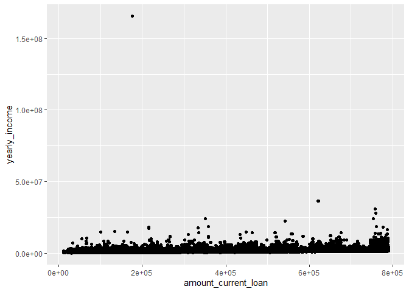
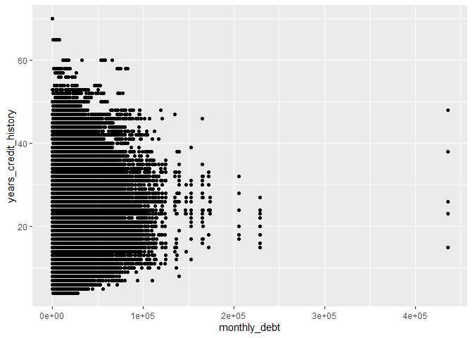

## Data overview

There are 10 000 000 rows and 17 columns in the document. So here you can see short summary of every column of the document. For example: min and max values, means and medians and also how many NA values there are. 


```r
df <- read.csv(file = "../1-data/train_data.csv")
df <- as.data.frame(df)
dim(df)
```

```
## [1] 10000000       17
```

```r
summary(df)
```

```
##        id                y          amount_current_loan     term          
##  Min.   :1.0e+00   Min.   :0.0000   Min.   :   10802    Length:10000000   
##  1st Qu.:2.5e+06   1st Qu.:0.0000   1st Qu.:  179652    Class :character  
##  Median :5.0e+06   Median :0.0000   Median :  312312    Mode  :character  
##  Mean   :5.0e+06   Mean   :0.2421   Mean   :11765909                      
##  3rd Qu.:7.5e+06   3rd Qu.:0.0000   3rd Qu.:  525096                      
##  Max.   :1.0e+07   Max.   :1.0000   Max.   :99999999                      
##                                                                           
##  credit_score       loan_purpose       yearly_income       home_ownership    
##  Length:10000000    Length:10000000    Min.   :    76627   Length:10000000   
##  Class :character   Class :character   1st Qu.:   848844   Class :character  
##  Mode  :character   Mode  :character   Median :  1174371   Mode  :character  
##                                        Mean   :  1378367                     
##                                        3rd Qu.:  1651499                     
##                                        Max.   :165557393                     
##                                        NA's   :1919747                       
##   bankruptcies   years_current_job  monthly_debt    years_credit_history
##  Min.   :0.000   Min.   : 0.0      Min.   :     0   Min.   : 4.00       
##  1st Qu.:0.000   1st Qu.: 3.0      1st Qu.: 10200   1st Qu.:14.00       
##  Median :0.000   Median : 6.0      Median : 16221   Median :17.00       
##  Mean   :0.117   Mean   : 5.9      Mean   : 18471   Mean   :18.22       
##  3rd Qu.:0.000   3rd Qu.:10.0      3rd Qu.: 24012   3rd Qu.:22.00       
##  Max.   :7.000   Max.   :10.0      Max.   :435843   Max.   :70.00       
##  NA's   :18354   NA's   :422327                                         
##  months_since_last_delinquent open_accounts   credit_problems  
##  Min.   :  0                  Min.   : 0.00   Min.   : 0.0000  
##  1st Qu.: 16                  1st Qu.: 8.00   1st Qu.: 0.0000  
##  Median : 32                  Median :10.00   Median : 0.0000  
##  Mean   : 35                  Mean   :11.15   Mean   : 0.1736  
##  3rd Qu.: 51                  3rd Qu.:14.00   3rd Qu.: 0.0000  
##  Max.   :176                  Max.   :76.00   Max.   :15.0000  
##  NA's   :5317819                                               
##  credit_balance     max_open_credit    
##  Min.   :       0   Min.   :0.000e+00  
##  1st Qu.:  113297   1st Qu.:2.771e+05  
##  Median :  210767   Median :4.726e+05  
##  Mean   :  297283   Mean   :7.687e+05  
##  3rd Qu.:  370253   3rd Qu.:7.914e+05  
##  Max.   :32878968   Max.   :1.540e+09  
##                     NA's   :192
```

## First plot

As we can see in the plot below, loan amount does not depends on yearly income. 


```
## Warning: Removed 1919747 rows containing missing values (`geom_point()`).
```

<!-- -->

## Second plot

In the plot below we can inspect the relationship between Monthly Debt Amount and Years of Credit History. 

<!-- -->
