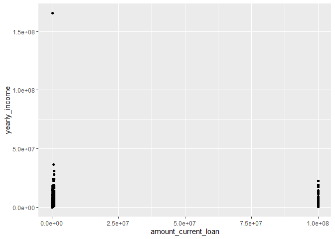
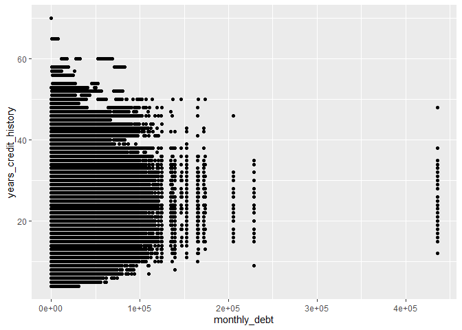

## Data overview

There are 1 000 000 rows and 17 columns in the document. So here you can see short summary of every column of the document. For example: min and max values, means and medians and also how many NA values there are. 


```r
df <- read.csv(file = "../1-data/train_data.csv")
df <- as.data.frame(df)
dim(df)
```

```
## [1] 1000000      17
```

```r
summary(df)
```

```
##        id                y       amount_current_loan     term          
##  Min.   :      1   Min.   :0.0   Min.   : 10802      Length:1000000    
##  1st Qu.: 250001   1st Qu.:0.0   1st Qu.:174394      Class :character  
##  Median : 500001   Median :0.5   Median :269676      Mode  :character  
##  Mean   : 500001   Mean   :0.5   Mean   :316659                        
##  3rd Qu.: 750000   3rd Qu.:1.0   3rd Qu.:435160                        
##  Max.   :1000000   Max.   :1.0   Max.   :789250                        
##                                                                        
##  credit_score       loan_purpose       yearly_income       home_ownership    
##  Length:1000000     Length:1000000     Min.   :    76627   Length:1000000    
##  Class :character   Class :character   1st Qu.:   825797   Class :character  
##  Mode  :character   Mode  :character   Median :  1148550   Mode  :character  
##                                        Mean   :  1344805                     
##                                        3rd Qu.:  1605899                     
##                                        Max.   :165557393                     
##                                        NA's   :219439                        
##   bankruptcies    years_current_job  monthly_debt    years_credit_history
##  Min.   :0.0000   Min.   : 0.00     Min.   :     0   Min.   : 4.0        
##  1st Qu.:0.0000   1st Qu.: 3.00     1st Qu.: 10324   1st Qu.:13.0        
##  Median :0.0000   Median : 6.00     Median : 16319   Median :17.0        
##  Mean   :0.1192   Mean   : 5.88     Mean   : 18550   Mean   :18.1        
##  3rd Qu.:0.0000   3rd Qu.:10.00     3rd Qu.: 24059   3rd Qu.:22.0        
##  Max.   :7.0000   Max.   :10.00     Max.   :435843   Max.   :70.0        
##  NA's   :1805     NA's   :45949                                          
##  months_since_last_delinquent open_accounts   credit_problems  
##  Min.   :  0.0                Min.   : 0.00   Min.   : 0.0000  
##  1st Qu.: 16.0                1st Qu.: 8.00   1st Qu.: 0.0000  
##  Median : 32.0                Median :10.00   Median : 0.0000  
##  Mean   : 34.9                Mean   :11.18   Mean   : 0.1762  
##  3rd Qu.: 51.0                3rd Qu.:14.00   3rd Qu.: 0.0000  
##  Max.   :176.0                Max.   :76.00   Max.   :15.0000  
##  NA's   :529539                                                
##  credit_balance     max_open_credit    
##  Min.   :       0   Min.   :0.000e+00  
##  1st Qu.:  113392   1st Qu.:2.700e+05  
##  Median :  210539   Median :4.600e+05  
##  Mean   :  293847   Mean   :7.367e+05  
##  3rd Qu.:  367422   3rd Qu.:7.674e+05  
##  Max.   :32878968   Max.   :1.540e+09  
##                     NA's   :27
```

## First plot

As we can see in the plot below, loan amount does not depends on yearly income. 


```
## Warning: Removed 219439 rows containing missing values (`geom_point()`).
```

<!-- -->

## Second plot

In the plot below we can inspect the relationship between Monthly Debt Amount and Years of Credit History. 

<!-- -->
